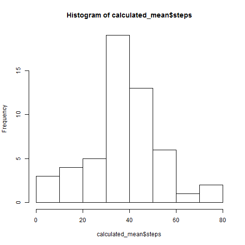
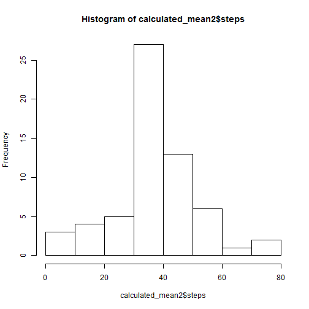
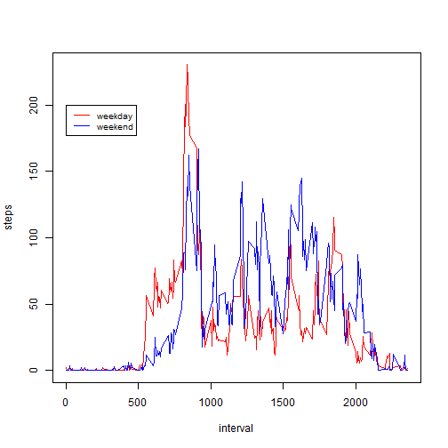

# Reproducible Research: Peer Assessment 1


## Loading and preprocessing the data
So this assumes that the file activity.csv is in the main folder.
Then the file can be loaded by using:

```r
data <- read.csv("activity.csv")
```
Quick inspection of the data shows that date is a Factor. A conversion to date
objects follows.

```r
str(data)
```

```
## 'data.frame':	17568 obs. of  3 variables:
##  $ steps   : int  NA NA NA NA NA NA NA NA NA NA ...
##  $ date    : Factor w/ 61 levels "2012-10-01","2012-10-02",..: 1 1 1 1 1 1 1 1 1 1 ...
##  $ interval: int  0 5 10 15 20 25 30 35 40 45 ...
```

```r
data[,2] <- as.Date(data[,2])
```

## What is mean total number of steps taken per day?
To calculate this I will use the aggregate function and then make a histogram.
Both mean and median are calculated and all NA are removed first.

```r
data1 <- na.omit(data)
calculated_mean <- aggregate(steps~date, data=data1,FUN=mean)
calculated_median <- aggregate(steps~date, data=data1,FUN=median)
hist(calculated_mean$steps)
```

 

```r
calculated_mean
```

```
##          date   steps
## 1  2012-10-02  0.4375
## 2  2012-10-03 39.4167
## 3  2012-10-04 42.0694
## 4  2012-10-05 46.1597
## 5  2012-10-06 53.5417
## 6  2012-10-07 38.2465
## 7  2012-10-09 44.4826
## 8  2012-10-10 34.3750
## 9  2012-10-11 35.7778
## 10 2012-10-12 60.3542
## 11 2012-10-13 43.1458
## 12 2012-10-14 52.4236
## 13 2012-10-15 35.2049
## 14 2012-10-16 52.3750
## 15 2012-10-17 46.7083
## 16 2012-10-18 34.9167
## 17 2012-10-19 41.0729
## 18 2012-10-20 36.0938
## 19 2012-10-21 30.6285
## 20 2012-10-22 46.7361
## 21 2012-10-23 30.9653
## 22 2012-10-24 29.0104
## 23 2012-10-25  8.6528
## 24 2012-10-26 23.5347
## 25 2012-10-27 35.1354
## 26 2012-10-28 39.7847
## 27 2012-10-29 17.4236
## 28 2012-10-30 34.0938
## 29 2012-10-31 53.5208
## 30 2012-11-02 36.8056
## 31 2012-11-03 36.7049
## 32 2012-11-05 36.2465
## 33 2012-11-06 28.9375
## 34 2012-11-07 44.7326
## 35 2012-11-08 11.1771
## 36 2012-11-11 43.7778
## 37 2012-11-12 37.3785
## 38 2012-11-13 25.4722
## 39 2012-11-15  0.1424
## 40 2012-11-16 18.8924
## 41 2012-11-17 49.7882
## 42 2012-11-18 52.4653
## 43 2012-11-19 30.6979
## 44 2012-11-20 15.5278
## 45 2012-11-21 44.3993
## 46 2012-11-22 70.9271
## 47 2012-11-23 73.5903
## 48 2012-11-24 50.2708
## 49 2012-11-25 41.0903
## 50 2012-11-26 38.7569
## 51 2012-11-27 47.3819
## 52 2012-11-28 35.3576
## 53 2012-11-29 24.4688
```

```r
calculated_median
```

```
##          date steps
## 1  2012-10-02     0
## 2  2012-10-03     0
## 3  2012-10-04     0
## 4  2012-10-05     0
## 5  2012-10-06     0
## 6  2012-10-07     0
## 7  2012-10-09     0
## 8  2012-10-10     0
## 9  2012-10-11     0
## 10 2012-10-12     0
## 11 2012-10-13     0
## 12 2012-10-14     0
## 13 2012-10-15     0
## 14 2012-10-16     0
## 15 2012-10-17     0
## 16 2012-10-18     0
## 17 2012-10-19     0
## 18 2012-10-20     0
## 19 2012-10-21     0
## 20 2012-10-22     0
## 21 2012-10-23     0
## 22 2012-10-24     0
## 23 2012-10-25     0
## 24 2012-10-26     0
## 25 2012-10-27     0
## 26 2012-10-28     0
## 27 2012-10-29     0
## 28 2012-10-30     0
## 29 2012-10-31     0
## 30 2012-11-02     0
## 31 2012-11-03     0
## 32 2012-11-05     0
## 33 2012-11-06     0
## 34 2012-11-07     0
## 35 2012-11-08     0
## 36 2012-11-11     0
## 37 2012-11-12     0
## 38 2012-11-13     0
## 39 2012-11-15     0
## 40 2012-11-16     0
## 41 2012-11-17     0
## 42 2012-11-18     0
## 43 2012-11-19     0
## 44 2012-11-20     0
## 45 2012-11-21     0
## 46 2012-11-22     0
## 47 2012-11-23     0
## 48 2012-11-24     0
## 49 2012-11-25     0
## 50 2012-11-26     0
## 51 2012-11-27     0
## 52 2012-11-28     0
## 53 2012-11-29     0
```
So apparently the median total number of steps is 0 for all days due to there
being more zeroes than anything else in this dataset.

## What is the average daily activity pattern?
To find the average daily pattern the aggregate is taken for the steps and
interval instead of the date. This data is plotted.

```r
averaged_mean <- aggregate(steps~interval, data=data1,FUN=mean)
plot(averaged_mean, type="l")
```

 
The maximum interval can be found as:

```r
averaged_mean[which(averaged_mean$interval==max(averaged_mean$interval)),1]
```

```
## [1] 2355
```


## Imputing missing values
So since I removed the na values earlier the number of nas can be found as
taking the diffence in rows from the untouched data.

```r
nrow(data)-nrow(data1)
```

```
## [1] 2304
```

The missing values will be filled in the with averaged rounded-off step count
for the interval.

```r
data2 <- data
Sys.setlocale("LC_TIME","English")
```

```
## [1] "English_United States.1252"
```

```r
for(i in 1:nrow(data2))
    {
    if(is.na(data2[i,1]))
        {
        data2[i,1] <- round(averaged_mean[which(averaged_mean[,1]==data2[i,3]),2],digits=0)
        }
    }
```
So to compare to the dataset with the removed values.

```r
calculated_mean2 <- aggregate(steps~date, data=data2,FUN=mean)
calculated_median2 <- aggregate(steps~date, data=data2,FUN=median)
hist(calculated_mean2$steps)
```

 

```r
calculated_mean
```

```
##          date   steps
## 1  2012-10-02  0.4375
## 2  2012-10-03 39.4167
## 3  2012-10-04 42.0694
## 4  2012-10-05 46.1597
## 5  2012-10-06 53.5417
## 6  2012-10-07 38.2465
## 7  2012-10-09 44.4826
## 8  2012-10-10 34.3750
## 9  2012-10-11 35.7778
## 10 2012-10-12 60.3542
## 11 2012-10-13 43.1458
## 12 2012-10-14 52.4236
## 13 2012-10-15 35.2049
## 14 2012-10-16 52.3750
## 15 2012-10-17 46.7083
## 16 2012-10-18 34.9167
## 17 2012-10-19 41.0729
## 18 2012-10-20 36.0938
## 19 2012-10-21 30.6285
## 20 2012-10-22 46.7361
## 21 2012-10-23 30.9653
## 22 2012-10-24 29.0104
## 23 2012-10-25  8.6528
## 24 2012-10-26 23.5347
## 25 2012-10-27 35.1354
## 26 2012-10-28 39.7847
## 27 2012-10-29 17.4236
## 28 2012-10-30 34.0938
## 29 2012-10-31 53.5208
## 30 2012-11-02 36.8056
## 31 2012-11-03 36.7049
## 32 2012-11-05 36.2465
## 33 2012-11-06 28.9375
## 34 2012-11-07 44.7326
## 35 2012-11-08 11.1771
## 36 2012-11-11 43.7778
## 37 2012-11-12 37.3785
## 38 2012-11-13 25.4722
## 39 2012-11-15  0.1424
## 40 2012-11-16 18.8924
## 41 2012-11-17 49.7882
## 42 2012-11-18 52.4653
## 43 2012-11-19 30.6979
## 44 2012-11-20 15.5278
## 45 2012-11-21 44.3993
## 46 2012-11-22 70.9271
## 47 2012-11-23 73.5903
## 48 2012-11-24 50.2708
## 49 2012-11-25 41.0903
## 50 2012-11-26 38.7569
## 51 2012-11-27 47.3819
## 52 2012-11-28 35.3576
## 53 2012-11-29 24.4688
```

```r
calculated_mean2
```

```
##          date   steps
## 1  2012-10-01 37.3681
## 2  2012-10-02  0.4375
## 3  2012-10-03 39.4167
## 4  2012-10-04 42.0694
## 5  2012-10-05 46.1597
## 6  2012-10-06 53.5417
## 7  2012-10-07 38.2465
## 8  2012-10-08 37.3681
## 9  2012-10-09 44.4826
## 10 2012-10-10 34.3750
## 11 2012-10-11 35.7778
## 12 2012-10-12 60.3542
## 13 2012-10-13 43.1458
## 14 2012-10-14 52.4236
## 15 2012-10-15 35.2049
## 16 2012-10-16 52.3750
## 17 2012-10-17 46.7083
## 18 2012-10-18 34.9167
## 19 2012-10-19 41.0729
## 20 2012-10-20 36.0938
## 21 2012-10-21 30.6285
## 22 2012-10-22 46.7361
## 23 2012-10-23 30.9653
## 24 2012-10-24 29.0104
## 25 2012-10-25  8.6528
## 26 2012-10-26 23.5347
## 27 2012-10-27 35.1354
## 28 2012-10-28 39.7847
## 29 2012-10-29 17.4236
## 30 2012-10-30 34.0938
## 31 2012-10-31 53.5208
## 32 2012-11-01 37.3681
## 33 2012-11-02 36.8056
## 34 2012-11-03 36.7049
## 35 2012-11-04 37.3681
## 36 2012-11-05 36.2465
## 37 2012-11-06 28.9375
## 38 2012-11-07 44.7326
## 39 2012-11-08 11.1771
## 40 2012-11-09 37.3681
## 41 2012-11-10 37.3681
## 42 2012-11-11 43.7778
## 43 2012-11-12 37.3785
## 44 2012-11-13 25.4722
## 45 2012-11-14 37.3681
## 46 2012-11-15  0.1424
## 47 2012-11-16 18.8924
## 48 2012-11-17 49.7882
## 49 2012-11-18 52.4653
## 50 2012-11-19 30.6979
## 51 2012-11-20 15.5278
## 52 2012-11-21 44.3993
## 53 2012-11-22 70.9271
## 54 2012-11-23 73.5903
## 55 2012-11-24 50.2708
## 56 2012-11-25 41.0903
## 57 2012-11-26 38.7569
## 58 2012-11-27 47.3819
## 59 2012-11-28 35.3576
## 60 2012-11-29 24.4688
## 61 2012-11-30 37.3681
```

```r
calculated_median
```

```
##          date steps
## 1  2012-10-02     0
## 2  2012-10-03     0
## 3  2012-10-04     0
## 4  2012-10-05     0
## 5  2012-10-06     0
## 6  2012-10-07     0
## 7  2012-10-09     0
## 8  2012-10-10     0
## 9  2012-10-11     0
## 10 2012-10-12     0
## 11 2012-10-13     0
## 12 2012-10-14     0
## 13 2012-10-15     0
## 14 2012-10-16     0
## 15 2012-10-17     0
## 16 2012-10-18     0
## 17 2012-10-19     0
## 18 2012-10-20     0
## 19 2012-10-21     0
## 20 2012-10-22     0
## 21 2012-10-23     0
## 22 2012-10-24     0
## 23 2012-10-25     0
## 24 2012-10-26     0
## 25 2012-10-27     0
## 26 2012-10-28     0
## 27 2012-10-29     0
## 28 2012-10-30     0
## 29 2012-10-31     0
## 30 2012-11-02     0
## 31 2012-11-03     0
## 32 2012-11-05     0
## 33 2012-11-06     0
## 34 2012-11-07     0
## 35 2012-11-08     0
## 36 2012-11-11     0
## 37 2012-11-12     0
## 38 2012-11-13     0
## 39 2012-11-15     0
## 40 2012-11-16     0
## 41 2012-11-17     0
## 42 2012-11-18     0
## 43 2012-11-19     0
## 44 2012-11-20     0
## 45 2012-11-21     0
## 46 2012-11-22     0
## 47 2012-11-23     0
## 48 2012-11-24     0
## 49 2012-11-25     0
## 50 2012-11-26     0
## 51 2012-11-27     0
## 52 2012-11-28     0
## 53 2012-11-29     0
```

```r
calculated_median2
```

```
##          date steps
## 1  2012-10-01  34.5
## 2  2012-10-02   0.0
## 3  2012-10-03   0.0
## 4  2012-10-04   0.0
## 5  2012-10-05   0.0
## 6  2012-10-06   0.0
## 7  2012-10-07   0.0
## 8  2012-10-08  34.5
## 9  2012-10-09   0.0
## 10 2012-10-10   0.0
## 11 2012-10-11   0.0
## 12 2012-10-12   0.0
## 13 2012-10-13   0.0
## 14 2012-10-14   0.0
## 15 2012-10-15   0.0
## 16 2012-10-16   0.0
## 17 2012-10-17   0.0
## 18 2012-10-18   0.0
## 19 2012-10-19   0.0
## 20 2012-10-20   0.0
## 21 2012-10-21   0.0
## 22 2012-10-22   0.0
## 23 2012-10-23   0.0
## 24 2012-10-24   0.0
## 25 2012-10-25   0.0
## 26 2012-10-26   0.0
## 27 2012-10-27   0.0
## 28 2012-10-28   0.0
## 29 2012-10-29   0.0
## 30 2012-10-30   0.0
## 31 2012-10-31   0.0
## 32 2012-11-01  34.5
## 33 2012-11-02   0.0
## 34 2012-11-03   0.0
## 35 2012-11-04  34.5
## 36 2012-11-05   0.0
## 37 2012-11-06   0.0
## 38 2012-11-07   0.0
## 39 2012-11-08   0.0
## 40 2012-11-09  34.5
## 41 2012-11-10  34.5
## 42 2012-11-11   0.0
## 43 2012-11-12   0.0
## 44 2012-11-13   0.0
## 45 2012-11-14  34.5
## 46 2012-11-15   0.0
## 47 2012-11-16   0.0
## 48 2012-11-17   0.0
## 49 2012-11-18   0.0
## 50 2012-11-19   0.0
## 51 2012-11-20   0.0
## 52 2012-11-21   0.0
## 53 2012-11-22   0.0
## 54 2012-11-23   0.0
## 55 2012-11-24   0.0
## 56 2012-11-25   0.0
## 57 2012-11-26   0.0
## 58 2012-11-27   0.0
## 59 2012-11-28   0.0
## 60 2012-11-29   0.0
## 61 2012-11-30  34.5
```
So there are some differences mostly with regards to median where some days
have medians that are non-zero compared to the others with medians with zeroes.
The mean has also changed depending on those days that have the most nas.

## Are there differences in activity patterns between weekdays and weekends?
First I need to add a new column with data on weekdays or weekends.

```r
data2$weekday <- weekdays(data2[,2])
for(i in 1:nrow(data2))
    {
    if(data2[i,4] %in% c("Monday","Tuesday","Wednesday","Thursday","Friday"))
        {
        data2[i,4] <- "weekday"
        }
    else
        {
        data2[i,4] <- "weekend"
        }
    }
```

Now for generating the two plots. First the dataset is divided into weekday and
weekend data sets.

```r
weekday <- data2[which(data2[,4]=="weekday"),]
weekend <- data2[which(data2[,4]=="weekend"),]
weekday_agg <- aggregate(steps~interval, data=weekday,FUN=mean)
weekend_agg <- aggregate(steps~interval, data=weekend,FUN=mean)
plot(weekday_agg,type="l", col="red")
lines(weekend_agg,type="l", col="blue")
legend(1, 200, c("weekday","weekend"), cex=0.8, col=c("red","blue"), lty=1:1);
```

 
